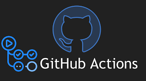
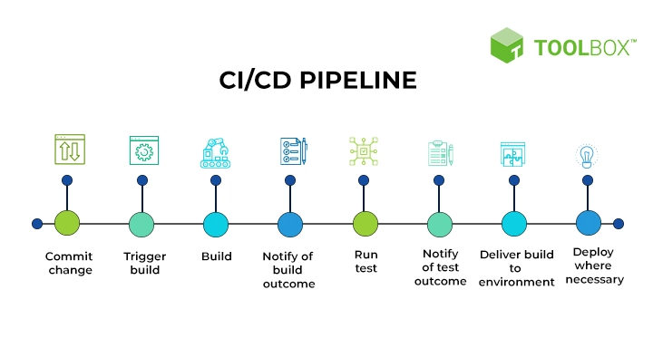

<h1 align='center'>
  Hi there 👋 I'm Luis Eduardo 👨‍💻
</h1>

  A IOT Engineer | C/C++ | Java | Javascript 
   

  &nbsp;&nbsp;

  &nbsp;&nbsp;

 

  

 

  
# Como criar o sites no GitHub, utilizando Git Actions e MkDocs

> ### [Link para o setup de criação do ambiante](README/README.md)

> workflow: criamos um arquivo de fluxo de trabalho escrito em sintaxe yaml com o seguinte diretório na pasta do projeto, .github/workflows/main.yml demos um nome qualquer.

> events: informamos ao GitHub quando essa ação será executada. Toda vez que fizermos um push para o branch principal.

> jobs: Esta é a propriedade que informa às ações ao GitHub o que executar quando a condição de gatilho for atendida. O nome do job é api_build . Você pode ter vários jobs em um arquivo de fluxo de trabalho.

> runs-on: Você define o ambiente onde a ação será executada. [ubuntu-latest]: isso significa a última imagem do docker do sistema operacional Ubuntu que o GitHub Actions tem disponível.

> steps: Contém ações, damos um nome a cada passo e temos vários passos.

> actions: Estas são as tarefas individuais. Temos 3 ações predefinidas por membros da comunidade do GitHub em nosso arquivo.

`Checkout`: Isso será git checkout mainramificado. Estamos usando ações pré-criadas.

`Setup node`: isso será instalado node @v20no sistema operacional Ubuntu.

> Instalar dependências

