# Como criar os arquivos com Python, MKDocs e plugins utilizando integração e entrega contínua com Git Actions

## Python

- PASSO_1: Verifique se tem o Python instalado

``` shell
python --version
```

``` shell
pip --version
```

OBS: Caso mostre a versão do Python é só prosseguir com os passos seguintes, caso não tenha pode baixar em https://www.python.org/downloads/

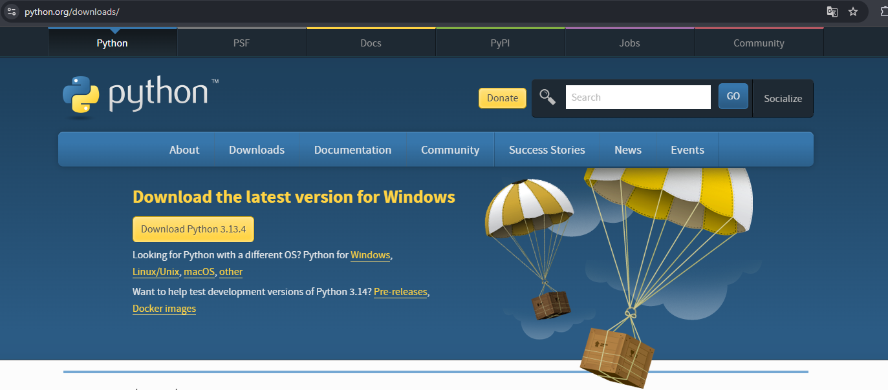

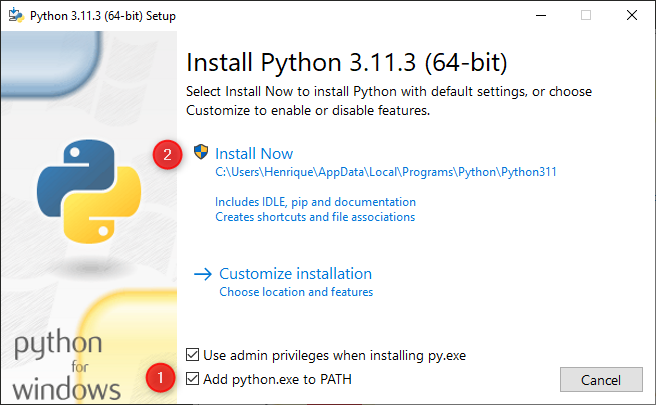

- Marque a opção "Add Python to PATH"
- Clique em "Install Now"

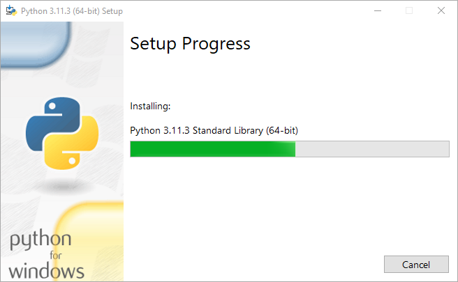

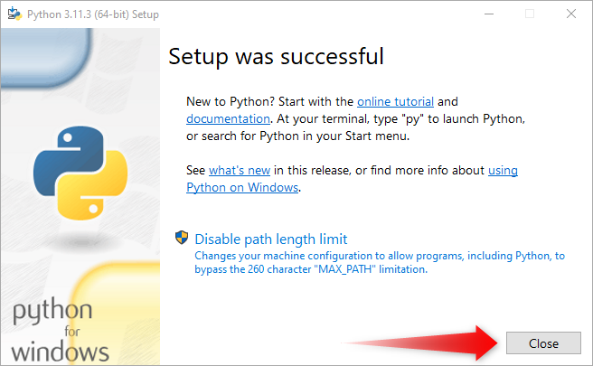

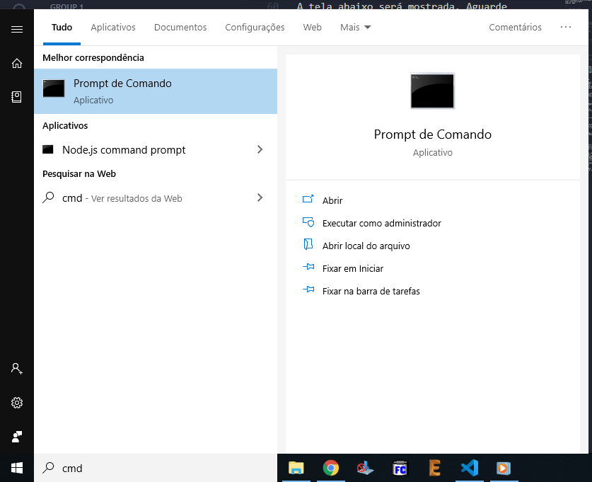

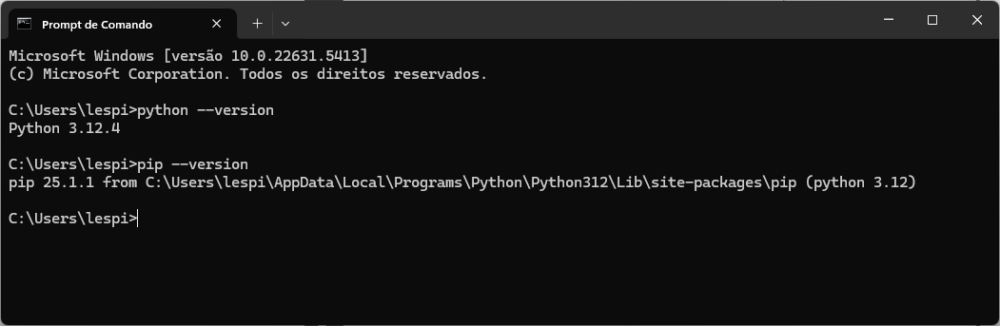

- PASSO_2: Crie um ambiente virtual do Python

python3 -m venv env

- PASSO_3: Ative o ambiente virtual

source ./env/bin/activate

- PASSO_4: Instale as dependências

pip3 install -r requirements.txt

- PASSO_5: Inicie o servidor

mkdocs serve

- PASSO_6: Faça o Deploy

mkdocs gh-deploy

## VSCode para os passos 2 e 3 acima

- Clicar F1 ou Crtl+SHIFT+P

- Digitar envirement

- Aguardar a criação do ambiente virtual do Python

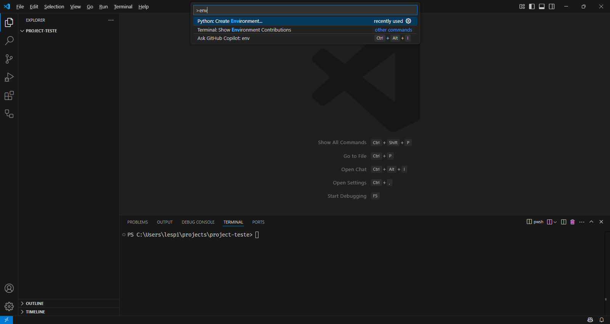

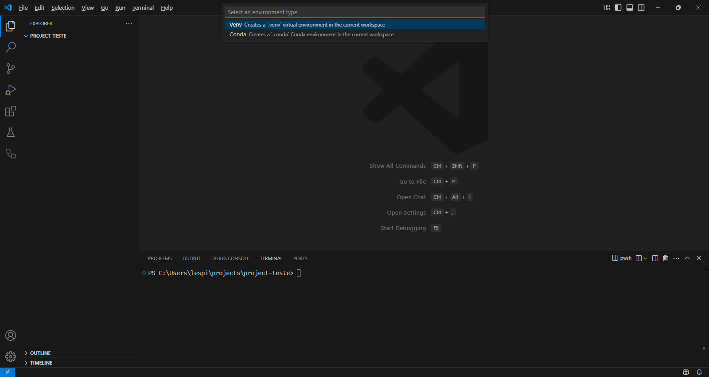

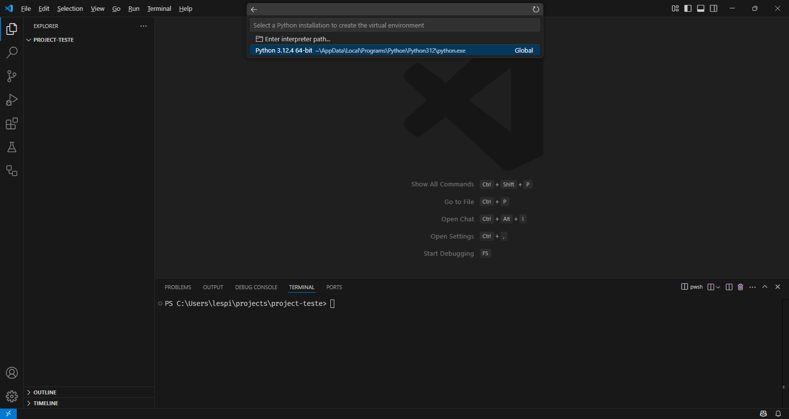

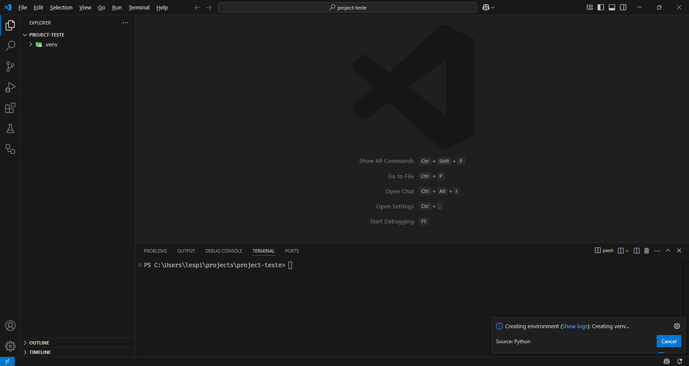

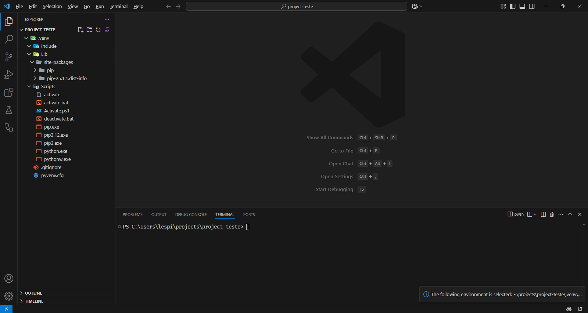

## GitHub


## GitHub Desktop

> https://desktop.github.com/download

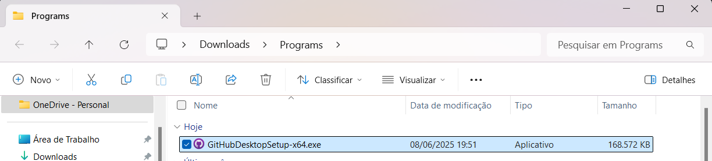


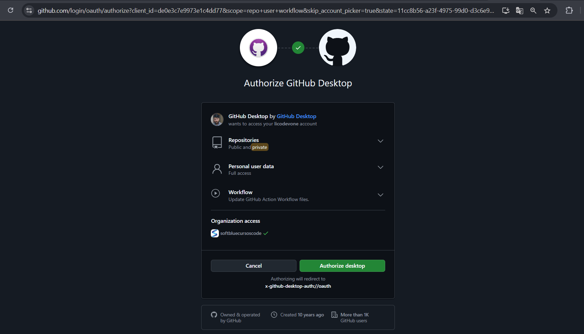

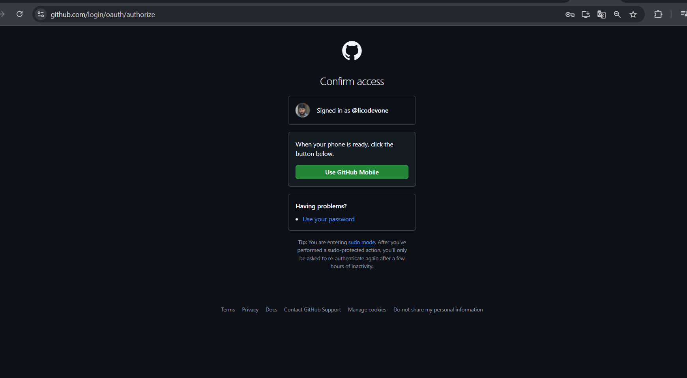

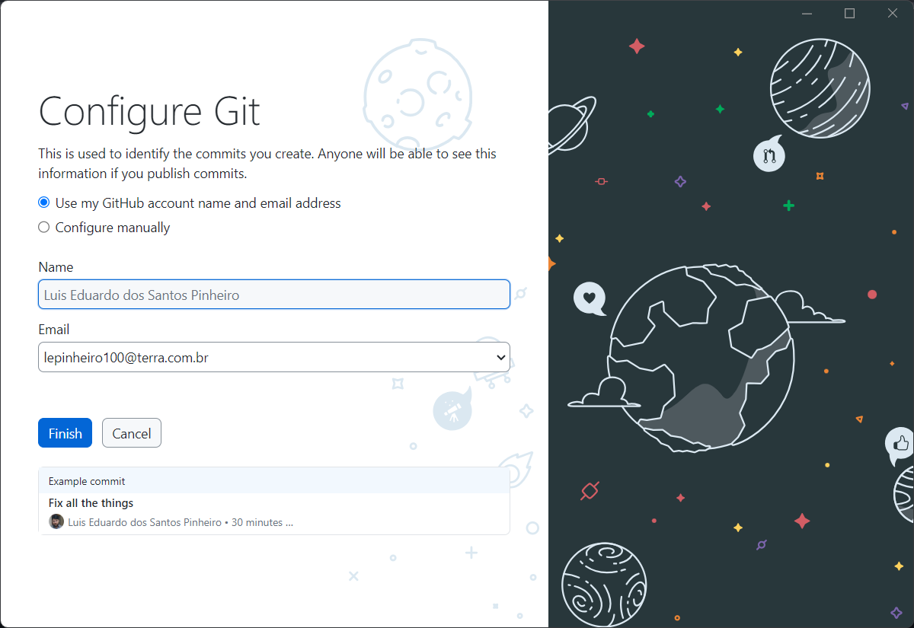

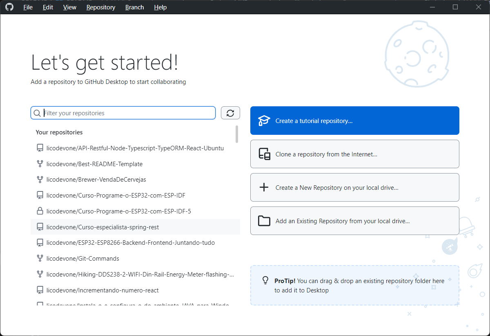

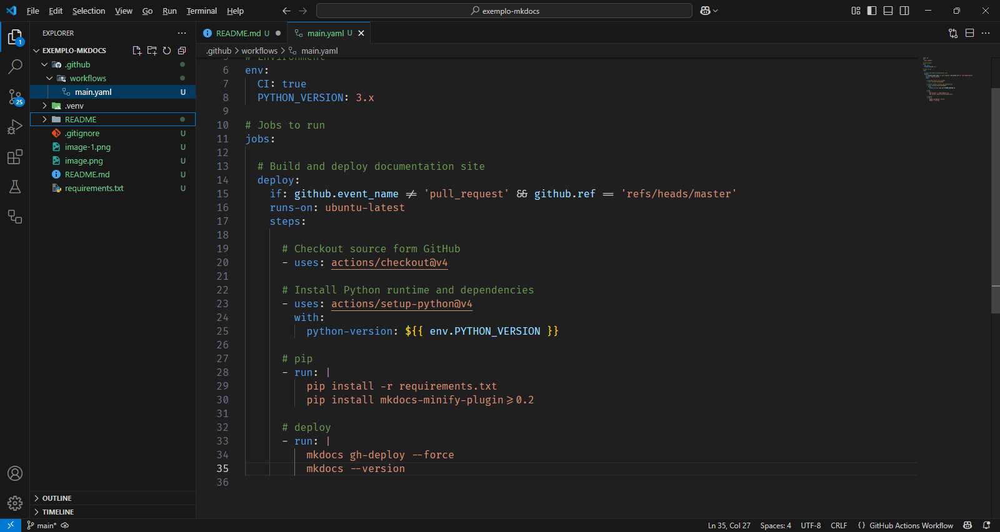

## MKDocs


Bibliografia:

> https://www.python.org/downloads

> https://github.com/Insper

> https://dev.to/ifeanyichima/github-actions-example-29pj


